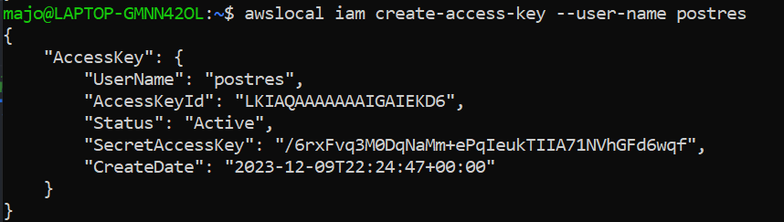
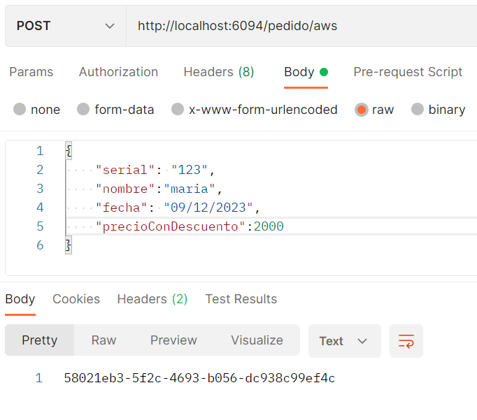
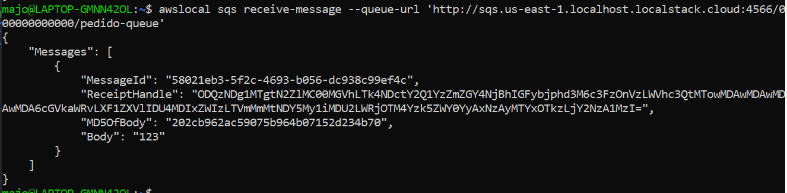

##Probando el api
en aplication.properties se agregan las variables:

- aws.access.key
- aws.secret.key

estos valores se obtienen de: 

se crea la cola y se manda un mensaje

se veridfica que llegue a la cola
